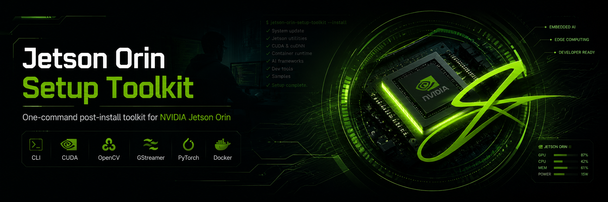

# Jetson Orin Setup Toolkit

<p align="center">
  
</p>

One-command post-install scripts for NVIDIA Jetson Orin (JetPack 5.x / 6.x).

Takes a freshly flashed Jetson and brings it to a ready-to-develop state with system updates, developer tools, GStreamer- and CUDA-enabled OpenCV, PyTorch, Docker, and a verification suite.

## Install

```bash
git clone https://github.com/Mertcan-Gelbal/jetson-orin-setup-toolkit.git
cd jetson-orin-setup-toolkit
bash install.sh
```

Reboot when finished:

```bash
sudo reboot
```

## What Gets Installed

### Core system

| Category           | Packages                                                                                                          |
| ------------------ | ----------------------------------------------------------------------------------------------------------------- |
| Developer tools    | git, curl, wget, build-essential, cmake, pkg-config, make, gcc, g++, gdb, nano, vim, tmux, screen, htop, tree, rsync, unzip, zip |
| Python runtime     | python3, python3-pip, python3-dev, python3-venv, python3-setuptools, python3-wheel                                |
| Python libraries   | numpy, pandas, matplotlib, pillow, tqdm, psutil                                                                   |
| Hardware utilities | i2c-tools, lm-sensors, usbutils, pciutils, can-utils                                                              |
| Networking         | net-tools, iproute2, iputils-ping, dnsutils, openssh-server, nmap, ethtool                                        |

### Media & vision

| Component | Details                                                                                  |
| --------- | ---------------------------------------------------------------------------------------- |
| GStreamer | gstreamer1.0-tools + plugins-base / good / bad / ugly + libav (CSI/USB camera pipelines) |
| FFmpeg    | ffmpeg, v4l-utils, libavcodec-dev, libavformat-dev, libswscale-dev                       |
| Image I/O | libjpeg-dev, libpng-dev, libtiff-dev                                                     |
| OpenCV    | python3-opencv + libopencv-dev — APT build with GStreamer & CUDA flags enabled           |

### NVIDIA / ML stack

| Component        | Details                                                                                |
| ---------------- | -------------------------------------------------------------------------------------- |
| PyTorch      | CUDA-accelerated wheel matching your JetPack version    |
| jetson-stats | jtop — real-time CPU/GPU/RAM/temperature monitor        |
| Editor       | VS Code                                                 |
| Browser      | Chromium                                                |

### Container runtime

| Component | Details                                                                       |
| --------- | ----------------------------------------------------------------------------- |
| Docker    | docker.io + docker-compose-plugin, enabled at boot, user added to `docker` group |

For details, see [`docs/USAGE.md`](docs/USAGE.md) and [`docs/TROUBLESHOOTING.md`](docs/TROUBLESHOOTING.md).

## License

MIT
